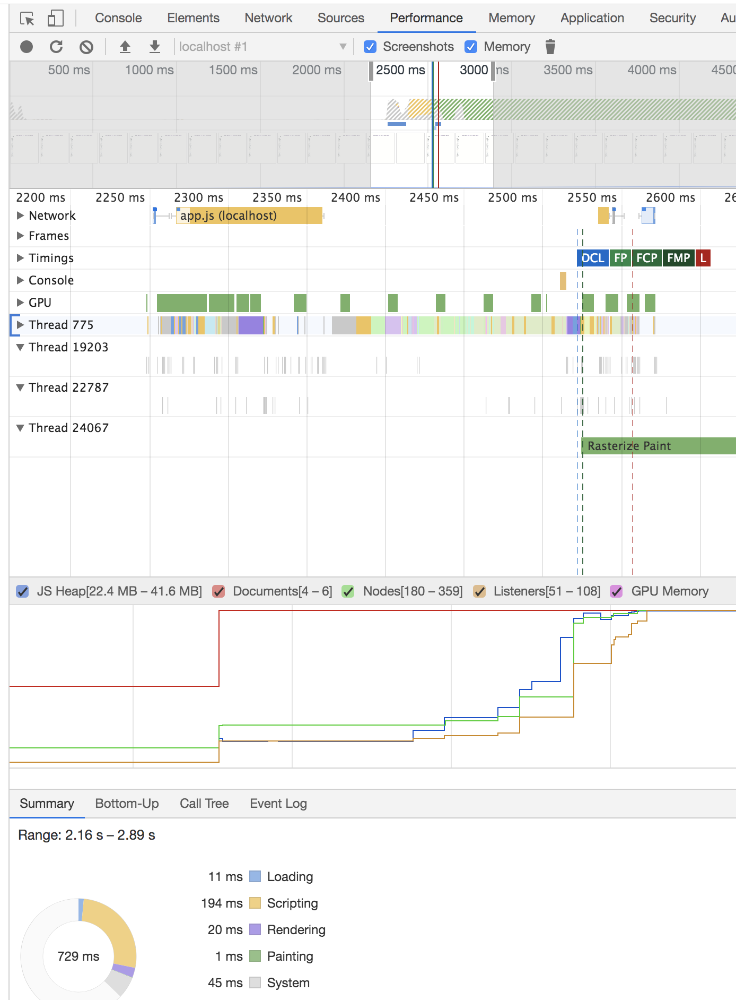
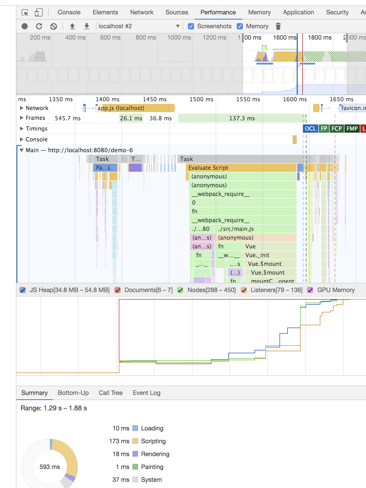
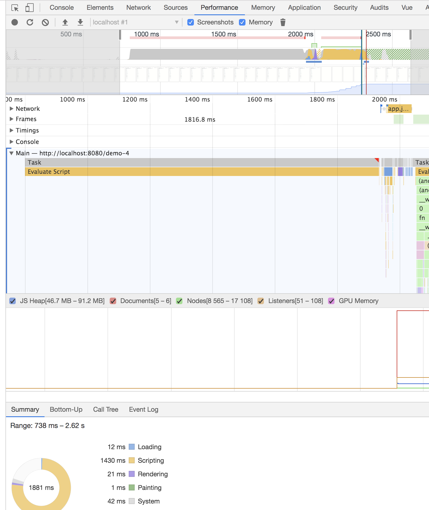

# test-project

> A Vue.js project

## Build Setup

``` bash
# install dependencies
npm install

# serve with hot reload at localhost:8080
npm run dev

# build for production with minification
npm run build

# build for production and view the bundle analyzer report
npm run build --report

# run unit tests
npm run unit

# run all tests
npm test
```

For a detailed explanation on how things work, check out the [guide](http://vuejs-templates.github.io/webpack/) and [docs for vue-loader](http://vuejs.github.io/vue-loader).
## 起因

偶然看了这个文章 https://juejin.im/post/5bf7ca2f6fb9a049a9795a88#heading-3
因为个人也对性能喜欢探究，从头品了下这个文章，一头雾水，于是自己按照自己想法写了它，想着测试下自己代码性能

## 测试

1234是迅雷前端的代码，56是我修改的递归组件和冻结递归组件的数据
数据量：this.getRandomData(3, 20)  3层 每层20条

first rendering: 初次渲染时间
expanded change: 点击节点展开渲染时间（这里统一统计最外层数据）

| | demo-5 | demo-6 | 文章最强优化 |
| :----: | :----: |:----: |:----: |
|first rendering| 3.60107421875ms | 3.666748046875ms | 111.51904296875ms |
|expanded change|  5.94482421875ms | 5.020263671875ms | 48.31103515625ms |
<table>
  <tr>
    <th>demo-5</th>
    <th>demo-6</th>
    <th>文章最强优化</th>
  </tr>
  <tbody>
    <tr>
      <td align="center" valign="middle">
          
      </td>
      <td align="center" valign="middle">
          
      </td>
      <td align="center" valign="middle">
          
      </td>
  </tbody>
</table>
## 总结

用一个组件渲染，会导致任何一个改动都会rerender。按照优化的第二点，任何的展开与关闭，其实还是要对比前后的VDOM。节点数量更多的情况下，计算量还是相当可观的。应该拆成递归组件的形式，这样局部的更新不会重新计算整一个树组件，性能会有很大提升的

冻结数据对于提升不大
